# 📺 广东移动IPTV自动抓取脚本

全流程自动化的广东移动IPTV频道列表和EPG节目单抓取工具，支持频道分组、黑名单过滤、自定义频道合并、分组排序、回看功能等。

**版本日期**: 2026.03.24
**项目版本**: v1.2

### 更新:外部 M3U 缓存与去重 (v1.2)

- 外部 M3U 默认优先网络更新，失败时自动回退本地 `cache.m3u` 缓存。
- 新增 `CACHE_M3U_FILENAME` 配置项，可自定义外部 M3U 缓存文件名。
- 外部 M3U 内部遇到“同 URL 不同别名”时，仅保留第一次出现的频道。
- `log/channel_processing.log` 会记录外部 M3U 的数据来源和 URL 重复过滤结果。

### 更新:EPG 天数设置简化 (v1.1)

- `EPG_DAY_OFFSETS`: [9] 代表包含明天 (+1) 在内的 9 天 EPG 下载，自动展开为 `[-7, -6, -5, -4, -3, -2, -1, 0, 1]`。
- 也可以手动设置列表 `[-5, -4, -3, -2, -1, 0, 1]`。

### 更新:自定义区域添加  IS_HWURL = False 开关

- 是否优先使用 hwurl (Huawei)
- True  = 优先提取 hwurl (如果 hwurl 为空则回退到 zteurl)
- False = 优先提取 zteurl (默认，如果 zteurl 为空则回退到 hwurl)
- 注意：无论此开关如何，回看代码(ztecode)始终使用 params["ztecode"],因为目前华为回看还没搞定,还是采用zte回看,华为的不一定能看吧

## 🎯 功能特性

### 核心功能

- **📥 自动下载频道列表**：从广东移动IPTV服务器自动获取频道JSON数据（要求能访问183.235.0.0/16网段）
- **🗂️ 智能频道分组**：自动将频道分类为央视、央视特色、广东、卫视、少儿、CGTN、华数咪咕、超清4k、广东地方台、其他等分组
- **🔄 频道去重**：自动去除重复频道，多清晰度的剔除了标清频道，只保留高清/超清/4k版本
- **🚫 黑名单过滤**：支持按标题关键词、频道代码(code)或播放链接(zteurl)过滤频道
- **➕ 自定义频道合并**：通过 `config/custom_channels.json` 添加自定义频道
- **🔗 外部 M3U 合并**：支持从外部 M3U 源下载并合并指定分组的频道（如粤语频道、体育频道等），自动应用黑名单过滤和 Nginx 代理
- **📊 分组排序**：通过 `config/channel_order.json` 自定义各分组内频道的排序
- **🏷️ 频道名称映射**：支持频道名称映射（如 "CCTV-3高清" → "CCTV-3综艺"），只修改最后名字，tvg-id tvg-name 适配不影响EPG对齐

### 📋 M3U文件生成

脚本会生成4个M3U文件：

1. **tv.m3u**：组播地址列表（原始组播地址）
2. **tv2.m3u**：单播地址列表（通过msd_lite转换的组播地址，回看参数支持ok影视,mytv-android[电视直播]）
3. **ku9.m3u**：单播地址列表（回看参数格式支持 酷9 1.7.7+,旧版不支持）
4. **aptv.m3u**：单播地址列表（回看参数格式支持 tvos-APTV）

### 📺 EPG节目单

- **⬇️ 自动下载EPG**：根据频道code自动下载EPG数据
- **🌐 支持多源下载**：可配置多个EPG下载源，自动分配任务
- **⚙️ 下载模式**：
  - `M3U_ONLY`：仅下载M3U文件中包含的频道EPG（推荐）
  - `ALL`：下载所有可用频道的EPG（包括被过滤的频道）
- **📦 生成文件**：
  - `t.xml`：XML格式的EPG节目单
  - `t.xml.gz`：压缩后的EPG文件
  - `log/epg_statistics.log`：EPG下载统计日志

### ⏪ 回看功能

- **🔍 自动识别**：根据JSON中的 `timeshiftAvailable` 或 `lookbackAvailable` 字段自动添加回看参数
- **📝 三模板支持**：
  - 标准回看模板：适配OK影视_3.16,,mytv-android_V2.0.0.191[电视直播]等播放器
  - KU9回看模板：适配酷9 1.7.7+
  - aptv回看模板：适配AppleTV tvos-APTV
- **🌐 Nginx代理支持**：支持通过Nginx代理回看源，实现外网访问

### 📝 日志文件

- **log/channel_processing.log**：频道处理日志，记录去重、改名、黑名单过滤等操作
- **log/epg_statistics.log**：EPG下载和合成统计信息

## ⚙️ 配置说明

脚本现在按以下优先级加载配置：

1. `config/config.json`（仓库默认配置，可提交到 GitHub）
2. `config/myconfig.json`（本地覆盖配置，优先级更高，不提交）

如果 `config/myconfig.json` 中存在同名配置项，会覆盖 `config/config.json`。

### 配置文件用法提示

- `config/config.json`：放常用配置，建议提交到仓库。
- `config/myconfig.json`：只放你本机差异项（例如本地 UDPXY、代理地址），优先级更高。
- 高级参数默认值已内置在 `tv.py`，通常不需要改代码。
- 这两个文件都必须是**标准 JSON**，不能写 `//` 或 `#` 注释。
- 需要说明时，请写在 `"__usage__"` 字段或 README 文档里。

### 基本配置

在 `config/config.json` 或 `config/myconfig.json` 中修改以下配置：

```json
# UDPXY地址（组播转单播）
"REPLACEMENT_IP": "http://c.top:7088/udp",

# ⏪ 回看源前缀，暂时是中兴平台的回看格式，移动都适用，华为的回看频道参数并没有实现，但是华为盒子的也能用中兴格式的
"CATCHUP_SOURCE_PREFIX": "http://183.235.162.80:6610/190000002005",

# 🌐 Nginx代理前缀（用于外网访问）默认为空 ""，只在局域网生效
"NGINX_PROXY_PREFIX": "http://c.top:7077",

# JSON数据源地址
"JSON_URL": "http://183.235.16.92:8082/epg/api/custom/getAllChannel.json",

# 📺 EPG下载源（默认为两个地址，可以删除一个）
"EPG_BASE_URLS": [
    "http://183.235.16.92:8082/epg/api/channel/",
    "http://183.235.11.39:8082/epg/api/channel/"
]
```

### ⏪ 回看模板配置

```json
# 标准回看模板（OK影视等）
"CATCHUP_URL_TEMPLATE": "{prefix}/{ztecode}/index.m3u8?starttime=${{utc:yyyyMMddHHmmss}}&endtime=${{utcend:yyyyMMddHHmmss}}",

# KU9回看模板（酷9最新版）
"CATCHUP_URL_KU9": "{prefix}/{ztecode}/index.m3u8?starttime=${{(b)yyyyMMddHHmmss|UTC}}&endtime=${{(e)yyyyMMddHHmmss|UTC}}",

#  添加APTV回看模板 (新增)
"CATCHUP_URL_APTV": "{prefix}/{ztecode}/index.m3u8?starttime=${{(b)yyyyMMddHHmmss:utc}}&endtime=${{(e)yyyyMMddHHmmss:utc}}"
```

### 📺 EPG配置

```json
# EPG下载开关
"ENABLE_EPG_DOWNLOAD": true,

# EPG下载模式
"EPG_DOWNLOAD_MODE": "M3U_ONLY",

# EPG下载日期偏移（单位：天）
# 示例：[-5, -4, -3, -2, -1, 0, 1] = 前5天 + 当天 + 明天
"EPG_DAY_OFFSETS": [-5, -4, -3, -2, -1, 0, 1],

# EPG合成模式
"XML_SKIP_CHANNELS_WITHOUT_EPG": true
```

### 🔗 外部 M3U 合并配置

支持从外部 M3U 源下载并合并指定分组的频道到生成的 M3U 文件中，可以用于补充本地频道列表中没有的频道（如粤语频道、冰茶体育）。

```json
# 外部 M3U 合并配置
"EXTERNAL_M3U_URL": "https://bc.188766.xyz/?ip=&mishitong=true&mima=mianfeibuhuaqian&json=true",
"EXTERNAL_GROUP_TITLES": ["粤语频道"],
"ENABLE_EXTERNAL_M3U_MERGE": true,
"CACHE_M3U_FILENAME": "cache.m3u"
```

**配置说明**：

- **EXTERNAL_M3U_URL**：外部 M3U 文件的下载地址，支持 HTTP/HTTPS 协议
- **EXTERNAL_GROUP_TITLES**：要提取的频道分组列表，脚本会从外部 M3U 中提取这些 `group-title` 的频道
- **ENABLE_EXTERNAL_M3U_MERGE**：是否启用外部 M3U 合并功能，设置为 `False` 可禁用此功能
- **CACHE_M3U_FILENAME**：外部 M3U 的本地缓存文件名，默认是 `cache.m3u`

**功能特性**：

- ✅ 自动下载外部 M3U 文件（使用浏览器 User-Agent 避免 403 错误）
- ✅ 默认优先网络更新，网络失败时自动回退到本地 `cache.m3u` 缓存
- ✅ 按 `group-title` 过滤提取指定分组的频道
- ✅ 自动应用黑名单过滤规则
- ✅ 外部 M3U 内部遇到“同 URL 不同别名”时，仅保留第一次出现的频道
- ✅ 支持 Nginx 代理（如果设置了 `NGINX_PROXY_PREFIX`，外部频道的 URL 和 Logo 会自动通过代理）
- ✅ 智能排序：如果外部分组在 `GROUP_OUTPUT_ORDER` 中，会按顺序输出；否则会添加到 M3U 文件末尾,同时应用分组内部排序
- ✅ 合并到所有生成的 M3U 文件（tv.m3u、tv2.m3u、ku9.m3u、 ）

**⚠️ 注意事项**：

- 如果外部分组名称在 `GROUP_OUTPUT_ORDER` 中已存在，外部频道会合并到对应分组位置
- 如果外部分组名称不在 `GROUP_OUTPUT_ORDER` 中，外部频道会添加到 M3U 文件末尾
- 外部频道同样会应用黑名单过滤规则
- 网络更新成功后会刷新本地 `cache.m3u`；如果网络更新失败，会优先尝试读取该缓存继续合并
- 外部 M3U 内部如果出现同一个 URL 对应多个别名，脚本只保留第一次出现的频道，后续重复条目仅记日志不合并
- 外部频道的 Logo 和 URL 会自动应用 Nginx 代理（如果已配置）

### 🚫 黑名单配置

```json
"BLACKLIST_RULES": {
    "title": ["测试频道", "购物", "导视", "百视通", "指南", "精选频道"],
    "code": [
        # 添加要过滤的频道代码
    ],
    "zteurl": [
        # 添加要过滤的播放链接
    ]
}
```

### 本地覆盖示例（推荐）

你可以只在 `config/myconfig.json` 放差异项，例如：

```json
{
  "IS_HWURL": false,
  "REPLACEMENT_IP": "http://your-udpxy:7088/udp",
  "ENABLE_EPG_DOWNLOAD": true
}
```

说明：`config/myconfig.json` 中未出现的键会继续使用 `config/config.json` 的值。

## 📋 配置文件

### config/custom_channels.json

自定义频道配置文件，格式示例：

```json
{
    "广东地方台": [
            {
        "title": "韶关综合高清",
        "code": "02000004000000052014120300000003",
        "ztecode": "",
        "icon": "http://183.235.16.92:8081/pics/micro-picture/channel/2020-11-04/e56deee4-990e-443d-8568-0f01953aed53.png",
        "zteurl": "rtp://239.11.0.84:1025",
        "supports_catchup": false,
        "quality": "高清"
        }
    ]
}
```

**⚠️ 注意**：如果自定义了新的分组，需要在 `tv.py` 的 `GROUP_DEFINITIONS` 和 `GROUP_OUTPUT_ORDER` 中添加对应的分组名称。

### config/channel_order.json

频道排序配置文件，生成的m3u会优先按此列表进行排序，格式示例：

```json
{
    "央视": [
        "CCTV-1综合",
        "CCTV-2财经",
        "CCTV-3综艺"
    ],

    "广东": [
        "广东珠江高清",
        "广东体育高清",
        "广东新闻高清",
        "东莞新闻综合高清",
        "东莞生活资讯高清",
        "广州新闻高清",
        "广州综合高清",
        "广东卫视高清",
        "广东民生高清",
        "经济科教高清",
        "大湾区卫视高清"
    ]
}
```

## 🚀 使用方法

### 1. 环境要求

- 🐍 Python 3.x

### 2. 运行脚本

```bash
python tv.py
```

### 3. 运行效果示例

```
你的组播转单播UDPXY地址是 http://c.cc.top:7088/udp/
你的回看源前缀是 http://183.235.162.80:6610/190000002005
你的nginx代理前缀是 http://c.cc.top:7077/
你的回看URL模板是 {prefix}/{ztecode}/index.m3u8?starttime=${{utc:yyyyMMddHHmmss}}&endtime=${{utcend:yyyyMMddHHmmss}}
你的KU9回看URL模板是 {prefix}/{ztecode}/index.m3u8?starttime=${{(b)yyyyMMddHHmmss|UTC}}&endtime=${{(e)yyyyMMddHHmmss|UTC}}
EPG下载开关: 启用
EPG下载配置: 重试3次, 超时15秒, 间隔2秒
成功加载频道排序文件: config/channel_order.json
成功加载自定义频道文件: config/custom_channels.json
自定义频道配置: ['广东', '广东地方台']
  分组 '广东' 有 5 个频道
  分组 '广东地方台' 有 27 个频道
成功获取 JSON 数据从 http://183.235.16.92:8082/epg/api/custom/getAllChannel.json
已过滤 14 个黑名单频道（主JSON）
自定义频道名称映射: '广州新闻-测试' -> '广州新闻高清'
自定义频道名称映射: '广州综合-测试' -> '广州综合高清'
已将回看源代理至: http://c.cc.top:7077/183.235.162.80:6610/190000002005
已为 150 个支持回看的频道添加catchup属性
已生成M3U文件: tv.m3u
已将回看源代理至: http://c.cc.top:7077/183.235.162.80:6610/190000002005
已为 150 个支持回看的频道添加catchup属性
已生成M3U文件: tv2.m3u
已将回看源代理至: http://c.cc.top:7077/183.235.162.80:6610/190000002005
已为 150 个支持回看的频道添加catchup属性
已生成M3U文件: ku9.m3u

已跳过 0 个缺少播放链接的频道。
总共过滤 14 个黑名单频道（主JSON: 14, 自定义: 0）
成功生成 191 个频道
单播地址列表: \\DS920\web\IPTV\cmcc_iptv_auto_py\tv2.m3u
KU9回看参数列表: \\DS920\web\IPTV\cmcc_iptv_auto_py\ku9.m3u
已生成处理日志: \\DS920\web\IPTV\cmcc_iptv_auto_py\log\channel_processing.log

开始下载节目单...
EPG 模式: M3U_ONLY (仅下载和合成 M3U 中的频道)
总共将为 191 个 M3U 频道条目尝试下载EPG。
XML 文件将基于这 191 个频道生成。
准备并行下载 191 个频道的EPG，使用 2 个epg地址下载...
  下载进度: 191/191 个频道 (100.0%)
所有下载任务已完成。
已保存节目单XML文件到: \\DS920\web\IPTV\cmcc_iptv_auto_py\t.xml
已生成压缩文件: \\DS920\web\IPTV\cmcc_iptv_auto_py\t.xml.gz

==================================================
EPG 合成统计
==================================================

基本统计:
   - XML 中总共写入 176 个频道
   - 其中 176 个频道成功合成了节目数据
   - 总共合成了 11731 个节目条目
   - 已跳过 15 个没有节目数据的频道

详细统计已保存到: \\DS920\web\IPTV\cmcc_iptv_auto_py\log\epg_statistics.log
```

## 📡 网络环境配置

### 前提条件

- **🌐 广东移动宽带**：脚本需要访问 `183.235.0.0/16` 网段的IPTV服务器
- **🔌 IPTV接口**：需要配置IPTV网络接口（如 `br-iptv`）

### 环境说明

**💡 楼主环境：广东移动宽带**

- **📶 路由器**：immortalwrt 23.05，单线复用，光猫到客厅只要一条线


- **🔧 光猫配置**：光猫改桥接后，只修改internet那边的vlan，就是划分internet vlan到单线复用线接口，用户侧自定义，设为3，iptv不划vlan，单线复用口直出（因为测试过iptv划vlan导致4分钟卡顿）

  - 部分光猫也可以全走vlan,就是 默认 iptv vlan 是48 internet 是41, 光猫 lan1取消全部绑定,光猫绑定设置哪里 48/48 41/41 这样就是划, openwrt 就是eth1.48 eth1.41
- **⚙️ 路由器配置**：wan口上网用vlan就是eth1.3，新建iptv口不用vlan，设置就是eth1，iptv口为br-iptv(dhcp模式)，桥接eth2,机顶盒接端口3就是桥接br-iptv网络,可以正常使用
- **🔐 鉴权设置**：由于实测移动iptv不鉴权，所以没有针对设置hostname、mac地址、Vendor class identifier设置

  - ⚠️ 如果设置了机顶盒mac等，导致机顶盒不可用了
  - ⚠️ 如果DHCP 无法获取ip,可能需要修改设置hostname、mac地址,参考[IPTV 折腾全记录 - 多种方案详解 - Hyun&#39;s home](https://www.hyun.tech/archives/iptv)

### 🔍 抓包获取频道数据（可选）

如果需要手动获取频道数据，可以通过以下方式：

#### 1. 📦 使用tcpdump抓包

```bash
# immortalwrt 安装tcpdump
tcpdump -i br-iptv -w /tmp/iptv_capture.pcap

# 打开盒子电源，等待启动完成后打开直播随便切几个台。回看一下,然后结束
```

#### 2. 🔍 使用Wireshark分析

将抓包文件提取到Windows，用Wireshark分析：

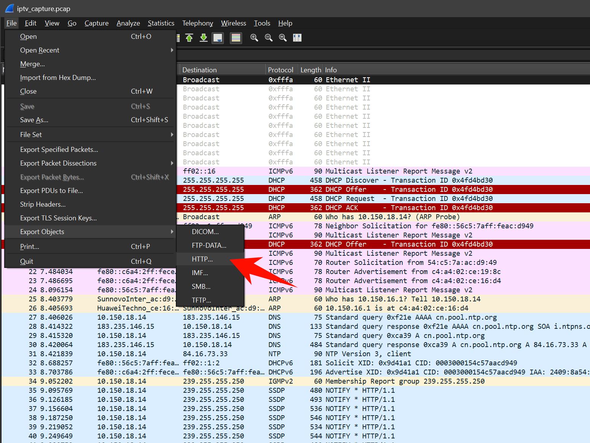

按大小排序得到200k左右的getChannel的json文件：

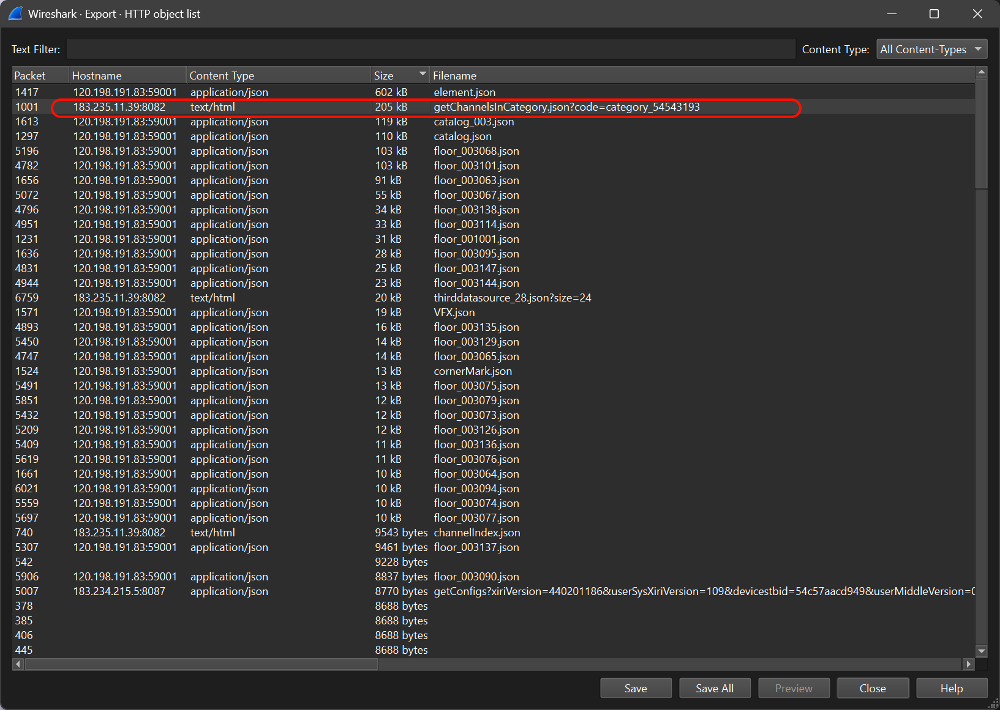

按大小排序最大的是回看流量，我的是中兴格式，华为回看流量暂未实现，但华为用户也可以直接使用中兴格式


点击 10 MB 数据，关闭窗口，追踪 HTTP 流。


拼接回看地址。


拼接 GET Host 头得出回看的实际地址，可以直接在 MPV 或者 PotPlayer 播放：
`http://183.235.162.80:6610//190000002005/ch000000000000328/index.m3u8?AuthInfo=xxx&version=xxx&starttime=20251015T220000.00Z&endtime=20251016T000000.00Z&IASHttpSessionId=RR14723020251016084714108007&ispcode=7`

简化后播放正常：

`http://183.235.162.80:6610//190000002005/ch000000000000328/index.m3u8?starttime=20251015T220000.00Z&endtime=20251016T000000.00Z`

得出回看源前缀：`http://183.235.162.80:6610//190000002005`

#### 3. 📡 分析得到的 API 地址

分析抓包数据可以得到以下可访问地址：

```
http://183.235.11.39:8082/epg/api/custom/getChannelsInCategory.json?code=category_54543193 
http://183.235.11.39:8082/epg/api/custom/getAllChannel.json  没有晴彩  看来服务地址不同返回不同的频道

http://183.235.16.92:8082/epg/api/custom/getAllChannel.json    这个地址也行,而且是标准的json格式  多了晴彩频道
http://183.235.16.92:8082/epg/api/custom/getAllChannel2.json 
```

**⚠️ 注意**：**默认网络是无法访问 `183.235.0.0/16` 的流量，必须通过iptv端口。网上有手动添加静态路由的办法，但是实测dhcp获得的ip会变动，有时是100.93.0.X，有时是10.150.0.x，有时是100.125.71.x。**

### 🛣️ 自动路由配置

由于默认网络无法访问 `183.235.0.0/16` 流量，需要配置路由。脚本提供了自动路由配置方案：

- 🔄 根据 br-iptv 接口的 DHCP 网关自动更新静态路由
- 🛣️ 将br-iptv 接口获取到的dhcp ip最后一位改为1后加入到路由网关，183.235.0.0/16 流量会经过新设置的网关出口，从而实现自动更新访问183流量
- ⚠️ **注意，br-iptv 接口为dhcp模式**，防火墙参考下面设置

#### 1. 📝 创建路由更新脚本

```bash
cat > /usr/bin/update-iptv-route << 'EOF'
#!/bin/sh

IP=$(ip addr show br-iptv 2>/dev/null | grep -o 'inet [0-9.]*/' | cut -d' ' -f2 | cut -d'/' -f1)

[ -z "$IP" ] && exit 1

CURRENT_GW=$(echo "$IP" | awk -F. '{print $1"."$2"."$3".1"}')

ip route del 183.235.0.0/16 2>/dev/null
ip route add 183.235.0.0/16 via "$CURRENT_GW" dev br-iptv
EOF

chmod +x /usr/bin/update-iptv-route
```

#### 2. 🔌 创建网络接口热插拔脚本

```bash
cat > /etc/hotplug.d/iface/99-iptv-route << 'EOF'
#!/bin/sh

[ "$ACTION" = "ifup" ] && [ "$INTERFACE" = "iptv" ] || exit 0

echo "IPTV 接口已启动，等待网络就绪..."
sleep 10
/usr/bin/update-iptv-route
EOF

chmod +x /etc/hotplug.d/iface/99-iptv-route
```

#### 3. ⚙️ 配置系统启动时自动运行

```bash
# 添加到 rc.local 确保启动时运行
echo "sleep 25 && /usr/bin/update-iptv-route" >> /etc/rc.local
```

#### 4. ✅ 验证路由配置

```bash
# 手动测试路由脚本
/usr/bin/update-iptv-route

# 检查路由是否添加
ip route | grep 183.235
```

### 🔥 防火墙配置

需要在防火墙中配置LAN到IPTV的转发规则，允许访问IPTV网络。

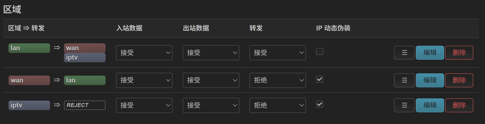

## 🧪 初步测试

### 🌐 实现浏览器访问

测试JSON数据源是否可访问：

- [http://183.235.16.92:8082/epg/api/custom/getAllChannel.json](http://183.235.16.92:8082/epg/api/custom/getAllChannel.json)

### ⏪ 实现回看测试

实现 potplayer 或者 mpv 回看，starttime/endtime 修改为昨天间隔 5 小时内的参数：

```
http://183.235.162.80:6610/190000002005/ch000000000000329/index.m3u8?starttime=20251118100000&endtime=20251118112000
```

## 🌐 Nginx代理配置（外网访问）

- 🌐 如果需要通过外网访问回看功能，需要配置Nginx代理。默认为空，想实现局域网观看再考虑回来设置
- 📝 要求自有域名、DDNS

### 1. 📦 安装Nginx

```bash
opkg update
opkg install nginx
```

### 2. ⚙️ 禁用UCI管理

- ⚠️ 由于openwrt默认使用uci配置文件，可以删除或者禁用
  - 修改 `/etc/config/nginx`，将 `uci_enable` 设置为 `false`，或删除UCI配置中的server块。

### 3. 🔧 配置Nginx代理

创建代理配置文件：

- 解析器设置为自己的 OpenWrt IP，也就是 DNS，可设为 223.5.5.5。

```bash
cat > /etc/nginx/conf.d/nginx-proxy.conf << 'EOF'
server {
    listen 7077 reuseport;
    listen [::]:7077 reuseport;
  
    # 优先用本机回环，更稳更科学
    resolver 127.0.0.1 10.10.10.1 valid=30s;
  
    # TCP优化
    tcp_nodelay on;      # 重要：减少直播延迟
    tcp_nopush off;      # 关闭：避免增加直播延迟
  
    # 通用代理 - 支持任意目标地址
    location ~* "^/(?<target_host>[^/]+)(?<target_path>.*)$" {

        set $proxy_target "http://$target_host$target_path$is_args$args";
  
        proxy_pass $proxy_target;
  
        proxy_set_header Host $target_host;
        proxy_set_header X-Real-IP $remote_addr;
        proxy_set_header X-Forwarded-For $proxy_add_x_forwarded_for;
        proxy_set_header X-Forwarded-Proto $scheme;
  
        # 核心重定向修复：一条正则足矣
        # 捕获 http://IP:端口/剩余部分 -> 重写为 http://你的域名:7077/IP:端口/剩余部分
        proxy_redirect ~^http://([^/]+)/(.*)$ http://$host:$server_port/$1/$2;

  
        proxy_connect_timeout 15s;
        proxy_send_timeout 30s;
        proxy_read_timeout 60s;
  
        # 直播核心设置：关缓冲
        proxy_buffering off;  
        proxy_cache off;
    }
}
EOF
```

### 4. 📝 配置主配置文件

```bash
cat > /etc/nginx/nginx.conf << 'EOF'
user root;
worker_processes 1;

error_log /var/log/nginx/error.log;
pid /var/run/nginx.pid;

events {
    worker_connections 1024;
}

http {
    include /etc/nginx/mime.types;
    default_type application/octet-stream;

    access_log off;

    sendfile on;
    keepalive_timeout 65;

    include /etc/nginx/conf.d/*.conf;
}
EOF
```

### 5. ✅ 检查和管理Nginx

```bash
# 检查配置是否有效
nginx -t

# 检查进程和端口
ps | grep nginx
netstat -ln | grep 7077

# 重载Nginx
/etc/init.d/nginx reload
/etc/init.d/nginx restart
```

配置完成后，在 `config/myconfig.json` 中设置 `"NGINX_PROXY_PREFIX": "http://c.top:7077"`，回看地址和Logo地址会自动通过Nginx代理：

- ⏪ 回看地址：`http://c.top:7077/183.235.162.80:6610/190000002005/ch000000000000104/index.m3u8?starttime=...`
- 🖼️ Logo地址：`http://c.top:7077/183.235.16.92:8081/pics/micro-picture/channelNew/xxx.png`

## ⏰ 定时任务

建议将脚本添加到定时任务中，定期更新频道列表和EPG。

### 🖥️ 群晖NAS

在群晖的"任务计划器"中添加定时任务。

### 🐧 Linux/OpenWrt

使用crontab：

```bash
# 编辑crontab
crontab -e

# 添加任务（每天凌晨2点运行）
0 2 * * * cd /path/to/script && /usr/bin/python3 tv.py
```

## 🔧 技术细节

### 📊 频道分组逻辑

脚本按照以下优先级对频道进行分类：

1. 🎬 少儿（必须在央视之前,避免CCTV少儿被分到央视组）
2. 🎥 超清4k（必须在央视之前）
3. 📺 央视
4. ⭐ 央视特色
5. 🏠 广东
6. 🌍 CGTN
7. 📡 卫视
8. 🎮 华数咪咕
9. 📋 其他
10. 🏘️ 广东地方台

### 📺 EPG下载机制

- 🌐 支持多源并行下载，自动分配任务
- 📅 支持按 `EPG_DAY_OFFSETS` 下载多天EPG（例如前5天到次日）
- 🔄 支持重试机制（默认重试3次）
- 📊 显示实时下载进度

### ⏪ 回看URL格式

- **标准格式**：`{prefix}/{ztecode}/index.m3u8?starttime=${{utc:yyyyMMddHHmmss}}&endtime=${{utcend:yyyyMMddHHmmss}}`
- **KU9格式**：`{prefix}/{ztecode}/index.m3u8?starttime=${{(b)yyyyMMddHHmmss|UTC}}&endtime=${{(e)yyyyMMddHHmmss|UTC}}`

## 📚 参考资源

- 📖 [IPTV相关教程](https://www.hyun.tech/archives/iptv)
- 🔗 [gmcc-iptv项目](https://github.com/pcg562240/gmcc-iptv)
- 🛠️ [iptv-tool工具](https://github.com/taksssss/iptv-tool) - 为没有EPG的频道提供额外支持
- 💬 [恩山原帖](https://www.right.com.cn/forum/thread-8453808-1-1.html)

## 📊 效果展示

### 使用效果

- **🌐 同城移动大局域网访问正常**：多套房子实现共享，鉴于上传带宽40mbps，正常只支持外网4路8m码率的
- **📺 EPG数据完整**：可通过 `EPG_DAY_OFFSETS` 获取多天EPG（如前5天到次日），节目条目更完整
- **🏘️ 本地台支持**：缺失大部分广东本地台的ztecode、code，因为默认json都不带本地台，需要通过 `config/custom_channels.json` 手动添加

### 播放器效果截图

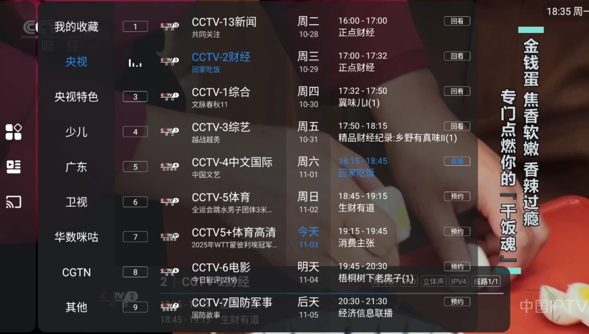

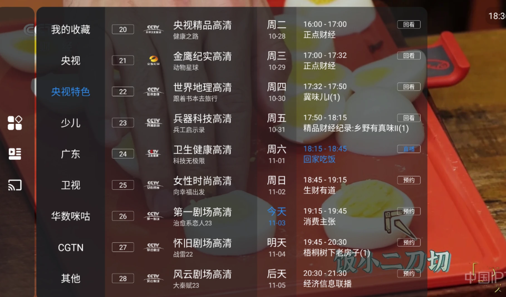

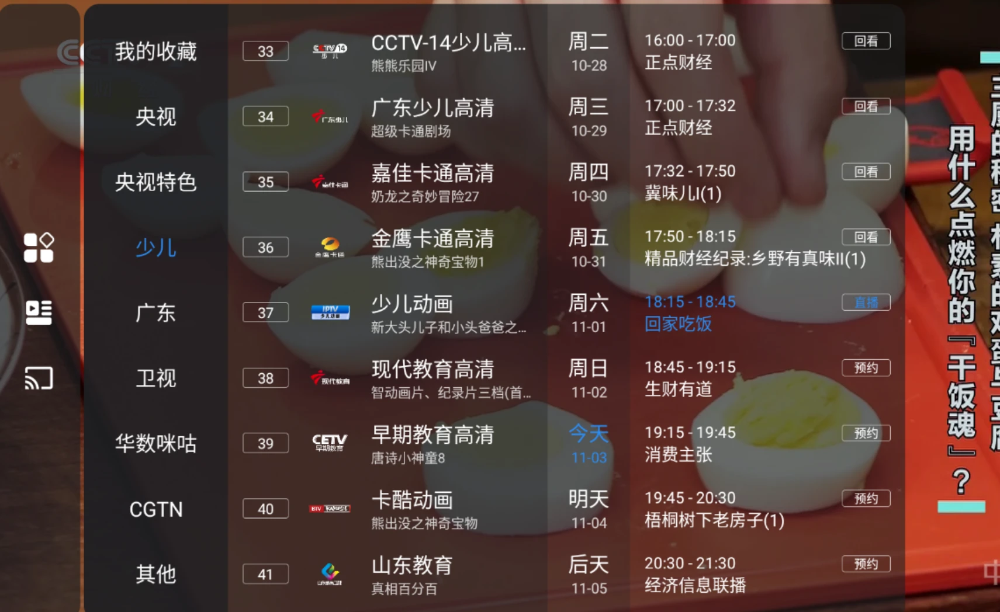

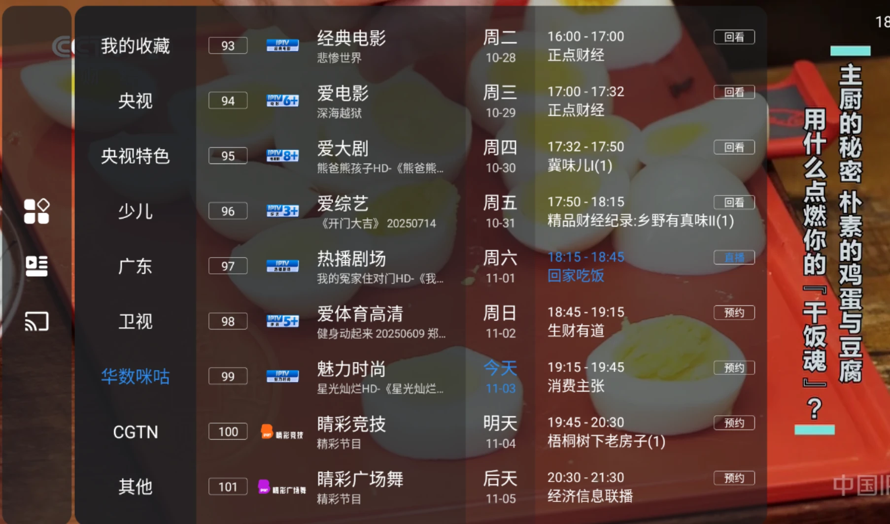

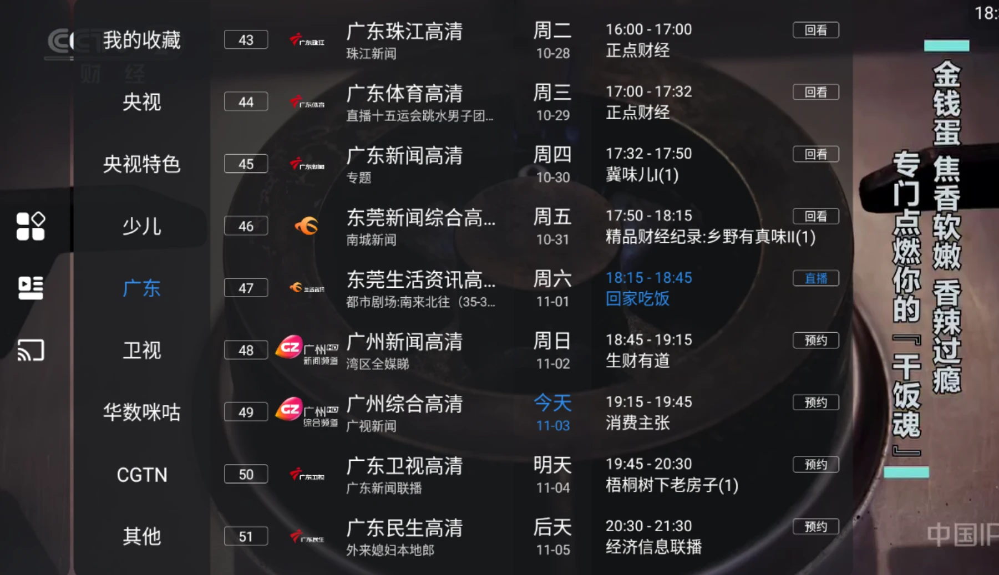

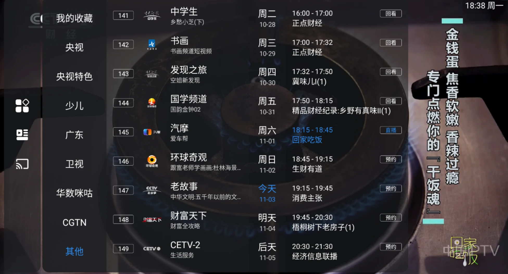

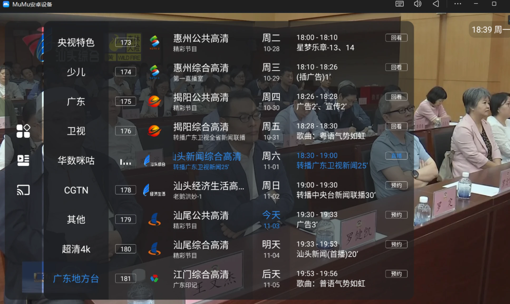

## ⚠️ 注意事项

1. **🌐 网络访问**：脚本需要能够访问 `183.235.0.0/16` 网段，必须通过IPTV接口
2. **📋 频道数据**：默认配置可能不包含所有本地台，需要通过 `config/custom_channels.json` 手动添加
3. **⏰ 回看时间**：回看使用UTC时间
4. **📺 EPG数据**：大部分频道有次日的EPG数据，比网上常见的EPG源更完整
5. **⏪ 额外主json**：[http://183.235.16.92:8082/epg/api/getAllChannel.json](http://183.235.16.92:8082/epg/api/getAllChannel.json) 这个地址包含大量地方台，但是近100个失效，暂时不采用，可以作为自定义参考

## 🐛 问题反馈

如果脚本运行出现问题，可以：

1. 📝 查看 `log/channel_processing.log` 了解频道处理详情
2. 📊 查看 `log/epg_statistics.log` 了解EPG下载情况
3. 🔍 检查网络连接和路由配置
4. 🤖 使用AI工具分析错误信息

## 📄 许可证

本项目仅供学习交流使用。
